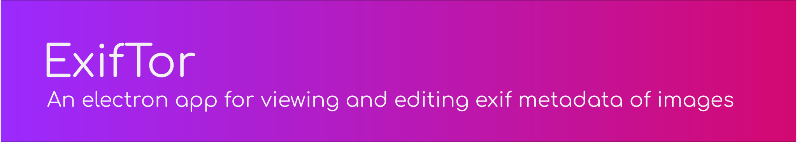

<br>

<div align="center">

[![Build Status][github-actions-status]][github-actions-url]
[![Github Tag][github-tag-image]][github-tag-url]

</div>

## Development

Clone the repo and install dependencies:

```bash
git clone https://github.com/silvio2402/exiftor.git
cd exiftor
npm install
```

### Starting Development

Start the app in the `dev` environment:

```bash
npm start
```

### Packaging for Production

To package apps for the local platform:

```bash
npm run package
```

## Maintainers

- [Silvio Brändle](https://github.com/silvio2402)

## Credits

Big thanks to the [Electron React Boilerplate](https://github.com/electron-react-boilerplate/electron-react-boilerplate) project for providing a great starting point for this project.

## License

GNU GPL v3 © [Silvio Brändle](https://github.com/silvio2402)

[github-actions-status]: https://github.com/silvio2402/exiftor/workflows/Test/badge.svg
[github-actions-url]: https://github.com/silvio2402/exiftor/actions
[github-tag-image]: https://img.shields.io/github/tag/silvio2402/exiftor.svg?label=version
[github-tag-url]: https://github.com/silvio2402/exiftor/releases/latest
